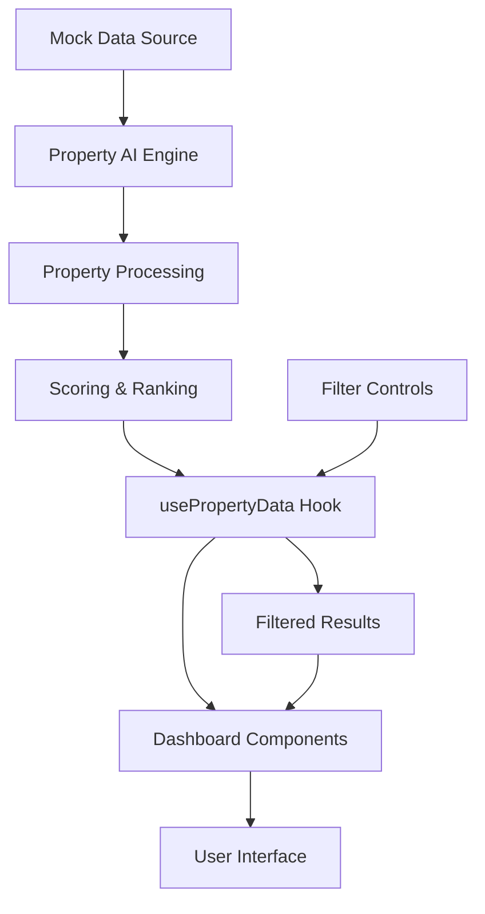

# PropAI Real Estate Investment Platform

## 🏗️ Complete Architecture Overview

This project implements a full-stack real estate investment decision platform with AI-powered property analysis, market insights, and investment recommendations.

## 📁 Project Structure

```
prop-ai-dash/
├── src/
│   ├── components/           # React UI Components
│   │   ├── ui/              # shadcn/ui base components
│   │   ├── PropertyCard.tsx # Individual property display
│   │   ├── MarketOverview.tsx # Market analytics dashboard
│   │   └── PropertyFilters.tsx # Advanced filtering system
│   │
│   ├── pages/               # Application pages
│   │   ├── Index.tsx        # Main dashboard entry point
│   │   ├── Dashboard.tsx    # Core investment dashboard
│   │   └── NotFound.tsx     # 404 error handling
│   │
│   ├── services/            # Business logic & AI engine
│   │   └── aiEngine.ts      # Property AI scoring & analysis
│   │
│   ├── hooks/               # Custom React hooks
│   │   └── usePropertyData.ts # Property data management
│   │
│   ├── types/               # TypeScript definitions
│   │   └── property.ts      # Property & analytics interfaces
│   │
│   ├── data/                # Mock data & simulation
│   │   └── mockProperties.ts # Simulated property listings
│   │
│   └── lib/                 # Utilities
│       └── utils.ts         # Helper functions
│
├── public/                  # Static assets
└── docs/                    # Documentation (for future expansion)
```

## 🧠 AI Engine Features

### Property Scoring Algorithm
- **Net Operating Income (NOI)** calculation
- **Capitalization Rate** analysis
- **Cash-on-Cash Return** computation
- **Monthly Cash Flow** projections
- **Risk Assessment** scoring
- **Market Trend Predictions**

### Scoring Factors (0-100 scale)
1. **Profitability (45%)**
   - Cap Rate (25%)
   - Cash-on-Cash Return (20%)
2. **Market Quality (35%)**
   - Crime Index (10%)
   - Job Growth (8%)
   - School Rating (7%)
   - Walkability (5%)
   - Property Age (5%)
3. **Risk Mitigation (20%)**
   - Violations penalty
   - Tax owed assessment
   - Days on market impact

## 🎯 Key Features Implemented

### 1. Market Overview Dashboard
- Real-time market analytics
- Top performing properties ranking
- Price and rent trend analysis
- Market health indicators

### 2. Property Analysis
- Comprehensive property cards
- Investment metric calculations
- Risk assessment scores
- Predictive analytics

### 3. Advanced Filtering System
- Price range filtering
- AI score thresholds
- Geographic (ZIP code) filtering
- Property type selection
- Cap rate minimums
- Crime index limits

### 4. Investment Metrics
- **Cap Rate**: Net Operating Income / Property Price
- **Cash-on-Cash Return**: Annual Cash Flow / Initial Cash Investment
- **Net Operating Income**: Annual Rent - Operating Expenses
- **Monthly Cash Flow**: Monthly Rent - Monthly Expenses - Mortgage

## 🎨 Design System

### Color Palette
- **Primary**: Professional blue (#3B82F6)
- **Success**: Investment green (#22C55E)
- **Warning**: Caution amber (#F59E0B)
- **Destructive**: Alert red (#EF4444)
- **Neutral**: Balanced gray (#9CA3AF)

### Component Architecture
- Fully responsive design
- Modern card-based layouts
- Gradient accents for premium feel
- Semantic color coding for metrics
- Interactive filtering and searching

## 🔄 Data Flow Architecture



## 📊 Simulated Data Points

### Property Attributes
- Basic info (address, price, rent, bedrooms, etc.)
- Financial metrics (taxes, insurance, maintenance)
- Market data (crime, job growth, schools, walkability)
- Legal status (zoning, violations, tax owed)

### Market Analytics
- Average property prices and rents
- Cap rate distributions
- Geographic performance rankings
- Market trend simulations

## 🚀 Demo Flow for Presentation

1. **Market Overview** - Show overall market health
2. **Top Deals** - Highlight AI-ranked opportunities
3. **Property Details** - Deep dive into individual properties
4. **Filtering** - Demonstrate advanced search capabilities
5. **Metrics Explanation** - Walk through AI scoring methodology

## 📈 Future Expansion Opportunities

### Backend Integration
- Real MLS data feeds
- Property scraping automation
- Historical market data
- User authentication system

### Advanced AI Features
- Machine learning rent predictions
- Market trend forecasting
- Portfolio optimization
- Risk modeling improvements

### Additional Features
- Property comparison tools
- Investment calculator
- Market alerts and notifications
- PDF report generation

## 🛠️ Technical Stack

- **Frontend**: React 18, TypeScript, Tailwind CSS
- **UI Framework**: shadcn/ui components
- **State Management**: React hooks, custom data management
- **Styling**: Modern design system with HSL colors
- **Icons**: Lucide React icon library
- **Build Tool**: Vite for fast development

## 🎥 Loom Presentation Ready

The platform is designed to be demo-friendly with:
- Realistic mock data
- Smooth animations and transitions
- Clear visual hierarchy
- Professional investment-focused design
- Easy-to-explain AI scoring methodology

This implementation provides a solid foundation that can be scaled with real data sources and additional features as needed for a production real estate investment platform.